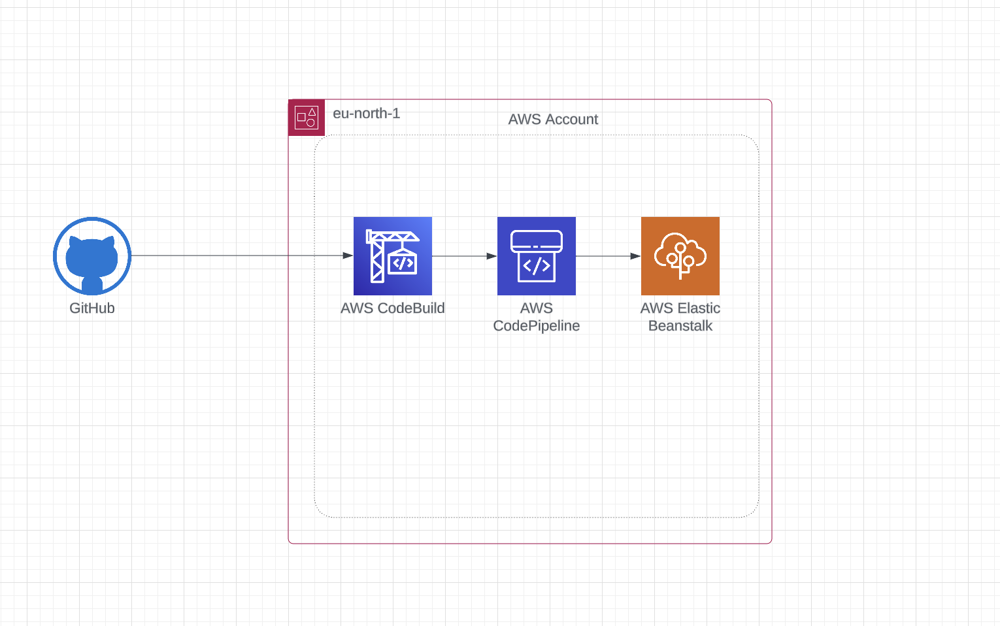

# AWS CI/CD Pipeline with GitHub, CodeBuild, CodePipeline, and Elastic Beanstalk

This repository outlines the infrastructure for a Continuous Integration/Continuous Deployment (CI/CD) pipeline on AWS, designed to automatically deploy code changes from a GitHub repository to AWS Elastic Beanstalk.

## Architecture Diagram



## Overview

This setup leverages AWS services to automate the deployment process:

1. **GitHub**: Hosts the source code repository.
2. **AWS CodeBuild**: Builds the application from the source code.
3. **AWS CodePipeline**: Orchestrates the build and deployment process.
4. **AWS Elastic Beanstalk**: Deploys and manages the application.

## Infrastructure Details

* **AWS Region**: `eu-north-1` (Stockholm)
* **Pipeline Trigger**: Changes pushed to the specified branch of the GitHub repository.
* **Build Process**:
  * Code is cloned from GitHub.
  * The application is packaged into a zip archive.
  * The archive is uploaded to Elastic Beanstalk.

## Setup Instructions

### Prerequisites

* An AWS account with appropriate permissions.
* A GitHub account with a repository containing your application code.
* Basic understanding of AWS services and CI/CD concepts.

### Steps

1. **Create an Elastic Beanstalk Environment**:
    * Navigate to the Elastic Beanstalk service in the AWS Management Console.
    * Create a new environment for your application.
    * Note the environment name, as it will be used later in the `buildspec.yml` file.

2. **Create an AWS CodeBuild Project**:
    * Go to the CodeBuild service in the AWS Console.
    * Create a new build project.
    * Configure the source provider to your GitHub repository.
    * Specify the branch to trigger the build.
    * Use the `buildspec.yml` file provided in this repository (or create your own).
    * Configure the environment as needed (e.g., runtime, image).
    * Ensure the CodeBuild role has necessary permissions to interact with Elastic Beanstalk.

3. **Create an AWS CodePipeline Pipeline**:
    * Navigate to the CodePipeline service in the AWS Console.
    * Create a new pipeline.
    * Configure the source stage to use GitHub as the source provider, selecting your repository and branch.
    * Add a build stage, selecting the CodeBuild project created earlier.
    * Add a deploy stage, selecting Elastic Beanstalk as the deployment provider and specifying your application and environment names.

4. **Configure `buildspec.yml`**:
    * In the root of your GitHub repository, create a `buildspec.yml` file.
    * Replace `YOUR_APPLICATION_NAME` and `YOUR_ENVIRONMENT_NAME` with your actual Elastic Beanstalk application and environment names.
    * The `buildspec.yml` should contain commands to:
        * Clone the repository.
        * Install dependencies.
        * Build the application (if necessary).
        * Create a zip archive of the application.
        * Deploy the archive to Elastic Beanstalk.

4. **Configure `buildspec.yml`**:
    * In the root of your GitHub repository, create a `buildspec.yml` file.
    * Replace `YOUR_APPLICATION_NAME` and `YOUR_ENVIRONMENT_NAME` with your actual Elastic Beanstalk application and environment names.
    * The `buildspec.yml` should contain commands to:
        * Clone the repository.
        * Install dependencies.
        * Build the application (if necessary).
        * Create a zip archive of the application.
        * Deploy the archive to Elastic Beanstalk.

    `buildspec.yml`:

    ```yaml
    version: 0.2

    phases:
      install:
        commands:
          # Install the AWS Elastic Beanstalk CLI (eb)
          - echo Installing Elastic Beanstalk CLI...
          - pip install awsebcli

      pre_build:
        commands:
          # Clone the GitHub repository (if it's not already in the build container)
          - echo Cloning the repository...
          - git clone <repo-url>
          - cd <repo-direcory>

      build:
        commands:
          # Zip the entire repository
          - echo Zipping the repository...
          - zip -r ../<repo-direcory>.zip .

      post_build:
        commands:
          # Deploy the code to Elastic Beanstalk
          - echo Deploying to Elastic Beanstalk...
          - eb init -p node.js <elastic-beanstalk-application-name> --region <hosted-region>
          - eb use <elastic-beanstalk-application-environment>
          - eb deploy

      artifacts:
        files:
          - <repo-direcory>.zip
    ```

5. **Commit and Push Changes**:
    * Commit the `buildspec.yml` file and any other changes to your GitHub repository.
    * Push the changes to the specified branch.
    * This will trigger the CodePipeline pipeline.

## Usage

Once the pipeline is set up, any push to the configured branch in your GitHub repository will automatically trigger the CI/CD pipeline, building and deploying your application to Elastic Beanstalk.
